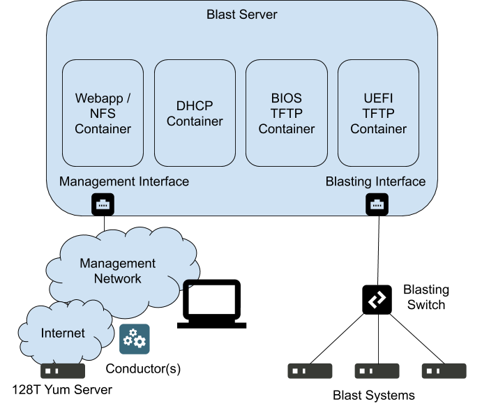

# 128T Blaster #

This repository contains files and instructions that can be used to setup a basic "blaster" which can be used to install 128T software on bare metal hardware using a PXE boot mechanism.  It is the user's responsibility for working with the hardware vendor for instructions on how to enable PXE boot on any specific piece of hardware.  It is also the user's responsibility for ensuring hardware is delivered with appropriate BIOS configuration to enable PXE boot and the appropriate boot order.  This server supports PXE boot for both BIOS and UEFI mechamisms.

This software is provided as a 128T Community supported application and is not maintained by 128 Technology officially.  Any issues can be reported through this github repository with no guarantee that a fix will be provided and no SLA for any fix timeframes.

> **Current Release: v1.2.1, August 16, 2021
> * Updates from v1.2:
> * Disable getty in containers to avoid taking over screen on attached monitor/console
> * Create kickstart pre section to eject USB disks to avoid overwriting devices that force PXE boot
> 
> * Updates from v1.1:
> * Introduced database schema versions - no more need to manually handle tables on upgrades (including this one)
> * Allow toggling of ISO post install behavior between default "shutdown" and "reboot" - useful when using a default quickstart
> * Simplified NFS setup - hopefully eliminate any NFS issues mounting ISOs
> * Support for bootstrap scipts - place pre- and/or post- bootstrap scripts into an ISO so they will be run during bootstrapping
> * Docker containers start automatically after a host reboot
> * new setup script - allows for easier turn up of blaster
 
## Topology ##



The above drawing illustrates the architecture of the Blaster.  The blasting server will need a minimum of two interfaces.  The first interface needs to be configured to connect into an existing LAN for management.  This LAN will need access out to the public Internet in order to obtain official 128T ISOs from the 128T yum servers and also to optionally obtain quickstart files from 128T Conductors.  The second interface needs to be connected to a dedicated switch or VLAN used exclusively for blasting purposes.

## Server Setup ##
The minimum requirements for the blaster server are 2 cores and 4GB RAM.  It is possible to run the blaster virtualized, but additional considerations need to be made.  The docker containers each use a unique MAC address which may conflict with a hypervisor's port security.  In this case, port security features must be disabled and potentially promiscuous mode turned on in the hypervisor's settings.  Additionally, the Linux OS for the guest may need promiscuous mode enabled on the second interface.

These instructions are based on a host system installed from a CentOS 1804 image. Since the blaster is mostly docker powered, this should be portable to other OSes. However, the setup script has not been extended to automatically handle all variants. You may try another OS at your own risk by looking at the [legacy installation instructions](docs/INSTALL.md) and modifying for your Linux distro.

To setup the blaster, as root run the following commands:
```
yum -y install git
git clone https://github.com/128technology/blaster.git
cd blaster
./setup.sh
```

The setup scripts will attempt to determine your management and blasting interfaces as shown in the drawing above, but please be prepared to indicate the appropriate Linux interfaces connected to each network.

### Optionally setting a proxy server ###
If a proxy server is required in order to initiate outbound HTTPS connections, please edit the file `webapp/proxy.conf` to point to the appropriate proxy server. The format of this parameter is shown below.
```
HTTPS_PROXY=http://[username[:password]@]<proxy address>:<proxy port>
```
If you modify this file, please be sure to remove the comment at the beginning of the variable.

If this variable is changed after building and starting the containers, please bring down and rebuild the containers as shown in the upgrade commands below.

## Upgrading the Blaster ##
If new updates are available in the git repo, the following steps can be used to update your blaster:
```
git pull origin master
docker-compose down
docker-compose build
docker-compose up -d
```

## Using the Blaster ##
Once the docker containers are running, pointing a browser to the management IP of the blast server should load the blaster menu. The blaster is fully self-documented through the web iterface, but some high level instructions follow.

### Certificate Management ###
The certificate management menu provides options for managing your 128T yum certificate.  In order for the blaster to download official 128T ISOs, a valid yum certificate must be in place.

### ISO Management ###
The ISO management menu provides options for managing official 128T ISOs. ISOs can be downloaded from the 128T yum repo if a valid certificate was provided, or they can be uploaded manually. This menu is also where to select which ISO is "active" for blasting purposes.

### Conductor Management ###
If you wish to use the blaster as a quickstart server, you may want to use this functionality to extract quickstart data from one or more 128T conductors.

### Quickstart Management ###
This menu allows you to view all quickstarts staged on the blaster for bootstrapping and manually upload individual quickstarts.

### Node Management ###
After a node has been blasted with an ISO, it will show up in this page allowing you to assign a quickstart file for bootstrapping.

### Password Management ###
You can override the generic ISO passwords with your own passwords for the root and t128 user. After making changes here these, need to be pushed to the ISOs by using the "Update ISOs" button

### Bootstrap Script Management ###
The bootstrapping process allows for scripts to be run pre- and post- bootstrapping, as shown in the [OTP documentation](https://docs.128technology.com/docs/intro_otp_iso_install/#scriptlets). These can be any script executable from the shell. The blaster does not validate these scripts, you must test and validate them yourself. The bootstrapping process expects the scripts to return and will then reboot the system, so a script calling `shutdown` will not work. A sample script is included showing how to stage a one-time shutdown script so that the system will power off after bootstrapping has fully completed.
